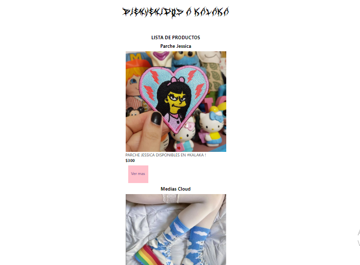

# Mi proyecto final 

Este proyecto lo hice basando en la tienda [KALAKA](https://www.instagram.com/kalaka.store/)

#### Es una "simulacion" de ecommerce de dicho local, en el cual se puede ...

* Ver una lista de productos

* Ver detalles de cada producto

* Armar un carrito de compras

* Un formulario

* Y por ultima generar una compra con un ID

>LINK DE LA PAGINA [KLKSTORE](https://klkstore-nta46liaw-cataolivar.vercel.app/)

